# E-commerce-back-end


## Description

This project required the creation of the back end for an e-commerce site by modifying starter code. This included creating models, routes and syncing sequelize models to the database.

For the back end to work, the user creates the schema using `MySQL shell`, seeds the database using `npm run seed` in the command-line, and then starts the server through `node server.js`. To then test the routes to GET, POST (create), PUT (update), and DELETE information in the databases, `Insomnia` can be used to run these HTTP routes.

> A walkthrough video of the application functionality, including running the routes in Insomnia, can be viewed here: https://drive.google.com/file/d/1sGmoO3TUtnb-tOsprFhehaYTdhUfUzhS/view?usp=sharing

## Table of Contents

- [User story](#user-story)
- [Acceptance criteria](#acceptance-criteria)
- [Technologies used/built with](#technologies-usedbuilt-with)
- [Installation](#installation)
- [Usage](#usage)
- [Credits](#credits)
- [License](#license)


## User story

```
AS A manager at an internet retail company
I WANT a back end for my e-commerce website that uses the latest technologies
SO THAT my company can compete with other e-commerce companies
```

## Acceptance criteria

```
GIVEN a functional Express.js API
WHEN I add my database name, MySQL username, and MySQL password to an environment variable file
THEN I am able to connect to a database using Sequelize
WHEN I enter schema and seed commands
THEN a development database is created and is seeded with test data
WHEN I enter the command to invoke the application
THEN my server is started and the Sequelize models are synced to the MySQL database
WHEN I open API GET routes in Insomnia for categories, products, or tags
THEN the data for each of these routes is displayed in a formatted JSON
WHEN I test API POST, PUT, and DELETE routes in Insomnia
THEN I am able to successfully create, update, and delete data in my database
```

## Technologies used/built with

This project used the following technologies to build it:

- JavaScript
- [Node.js](https://nodejs.org/en/)
- [Express.js](https://expressjs.com/)
- [Sequelize NPM package](https://sequelize.org/)
- [MySQL2 NPM package](https://www.npmjs.com/package/mysql2)
- [dotenv NPM package](https://www.npmjs.com/package/dotenv)

## Installation

1. Clone the repo (HTTPS: `git clone https://github.com/CharDige/E-commerce-back-end.git` or SSH: `git clone git@github.com:CharDige/E-commerce-back-end.git`)

2. Install all NPM packages by running `npm i` in the command-line. Or, if you wish to install each NPM package individually:

- Install Express.js NPM package `npm install express`
- Install Sequelize NPM package `npm install sequelize`
- Install MySQL2 NPM package `npm install mysql2`
- Install dotenv NPM package `npm install dotenv`

## Usage

Below, you will find a walkthrough video and screenshots to show the application functionality and how it can be used.

### Walkthrough video

To view how this e-commerce back end works, you can watch [this walkthrough video](https://drive.google.com/file/d/1sGmoO3TUtnb-tOsprFhehaYTdhUfUzhS/view?usp=sharing)

### Screenshots

After the installation process has been undertaken, the user will first need to run the `schema.sql` file in MySQL shell to create the database. This can be done by running `mysql -u yourMySQLusername -p` in the command-line, which will then prompt the user to enter their MySQL password.

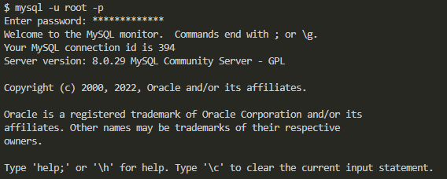

Once logged in to MySQL shell, the user will need to run the `schema.sql` file. Depending on where they opened the terminal, the command may be a little different. In the walkthrough video and the screenshot below, `source db/schema.sql;` is used since the terminal is running in the root directory. However, if the terminal is running from the `db` directory, then `source schema.sql;` can be run instead.

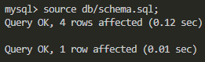

The user can then quit MySQL shell by running `quit;`.

Once back in the command-line, the user now needs to seed the database. This can be done by running the command `npm run seed`.

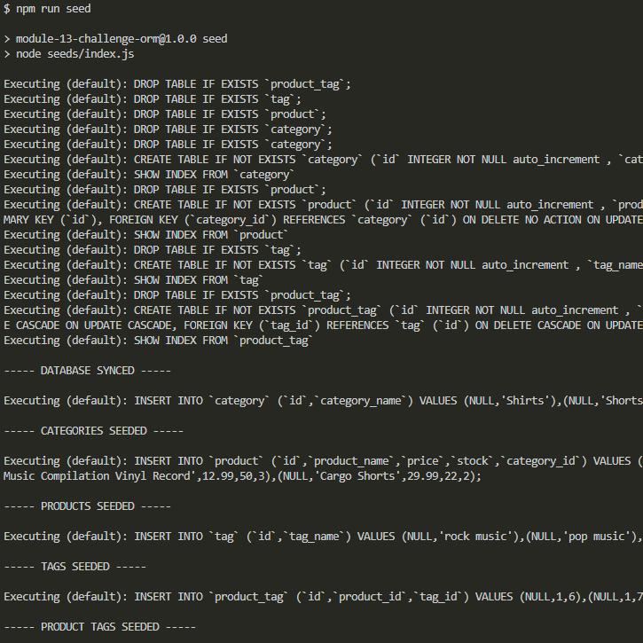

The database should now have data in it. Now, the server needs to be started so that the user can run the routes and see what's in the databases. To do so, the user can run `node server.js` in the command-line.

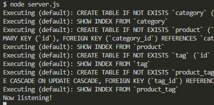

Once the server is running, the user can open `Insomnia` and begin testing the routes. Below are screenshots of `Insomnia` running a few tests, including GET, POST, PUT and DELETE routes.

>For a full functionality walkthrough of every GET, POST, PUT and DELETE route, watch the [walkthrough video](https://drive.google.com/file/d/1sGmoO3TUtnb-tOsprFhehaYTdhUfUzhS/view?usp=sharing)

**GET all categories**

The URL:

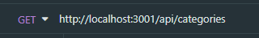

The result:

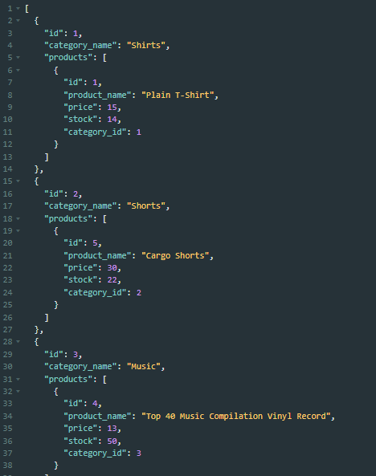

**GET specific product**

*Note: To get a specific category, product or tag, the URL needs to end with a id number of the category, product or tag*

The URL:

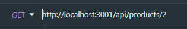

The result:

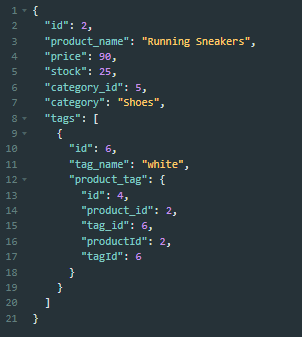

**POST (create) tag**

The URL and JSON:

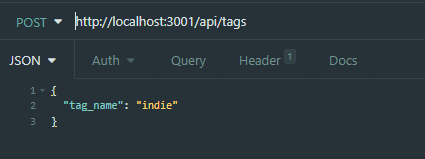

The result:

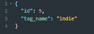

**PUT (update) category**

*Note: to update a category, product or tag, the URL needs to end with the id number of the category, product or tag that the user wants to update*

The URL and JSON:

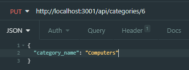

The result:

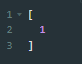

**DELETE product**

*Note: to delete a category, product or tag, the URL needs to end with the id number of the category, product or tag that the user wants to delete*

The URL:

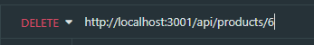

The result:

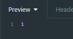

## Credits

Here's a list of resources I'd like to credit that really helped with the development of this application:

- [Sequelize - Validations & Constraints](https://sequelize.org/docs/v6/core-concepts/validations-and-constraints/)
- [sebhastian - Adding the default value to Sequelize models and migrations](https://sebhastian.com/sequelize-default-value/)
- [Sequelize - Association](https://sequelize.org/api/v6/class/src/associations/base.js~association)
- [Sequelize - Model Instances](https://sequelize.org/docs/v6/core-concepts/model-instances/)


## License

[MIT License - Copyright (C) 2022 Charlotte Dige](./LICENSE)